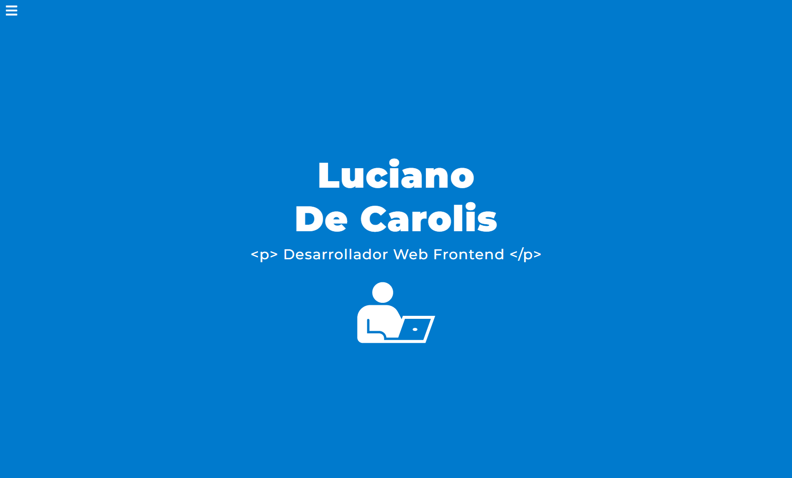

# Portfolio Web Responsive 2022

## _Vista para mobile, tablet y desktop!_

¡Hola, soy **Lucho**! 👋

Este portfolio fue creado con las siguientes **tecnologías**:

- React
- Vite (_como alternativa más rápida frente a create-react-app_)
- Styled components

Además se utilizaron las siguientes **librerias**:

- Aos,
- EmailJs,
- React-Icons,
- React-Scroll,
- Typewriter-Effect

## Objetivos:

- Desarrollar mi portfolio para mostrarle al mundo quién soy, qué hago y qué empleos busco para continuar con mi crecimiento profesional.

- Practicar las bases del diseño web responsive y la maquetación.

- Conocer y practicar el uso de nuevas librerias para el entorno de React.

---

## Previsualización:

## Visitar:

[Portfolio Luciano De Carolis](https://vercel.com/ludcs/luciano-de-carolis)

---

## Mi LinkedIn:

[Ver Perfil](https://www.linkedin.com/in/luciano-de-carolis-36a751148/)
